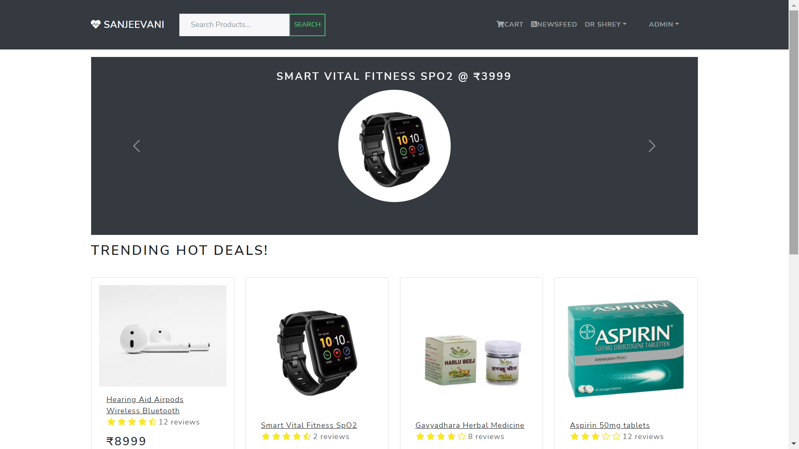
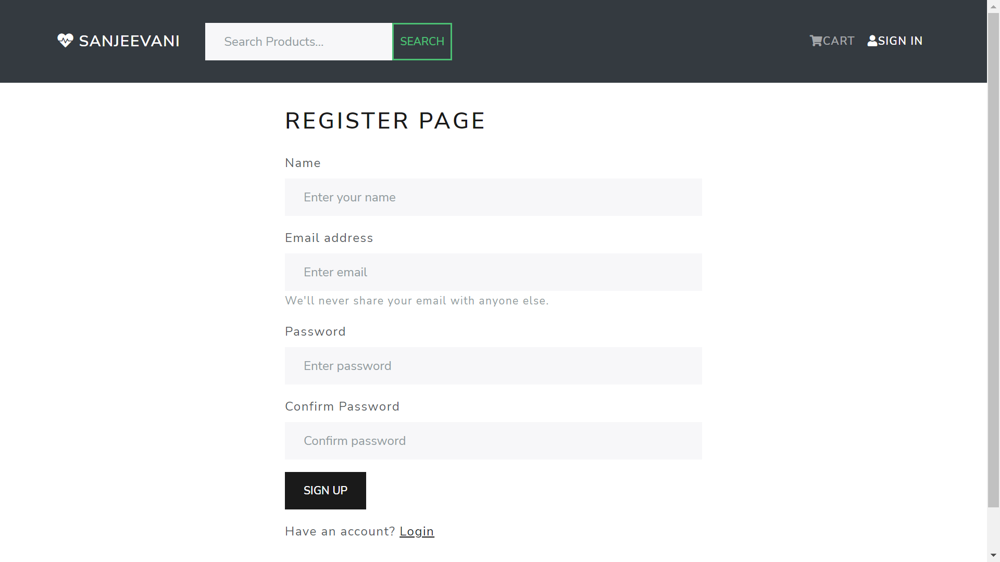
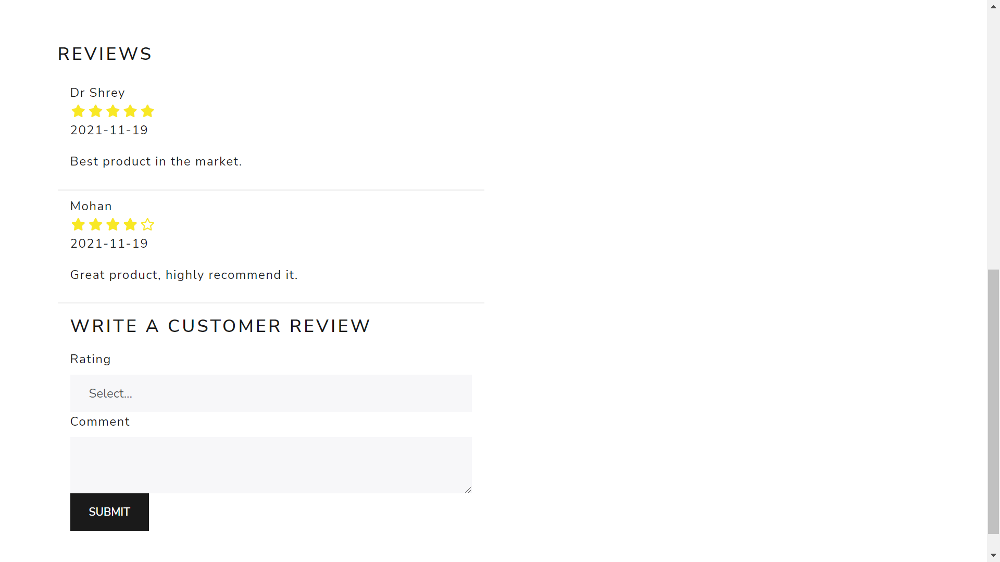
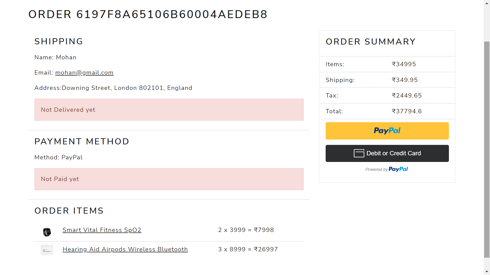
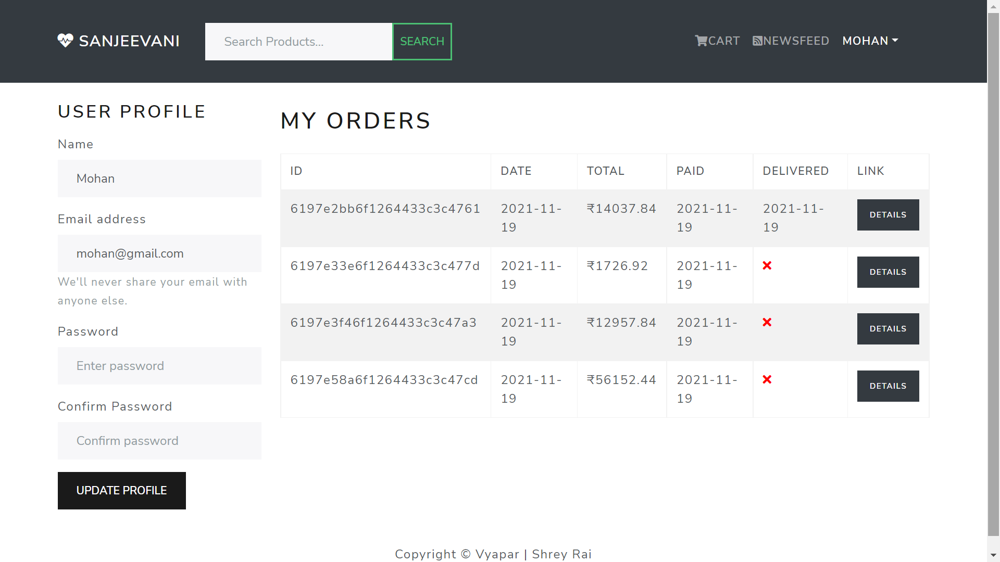
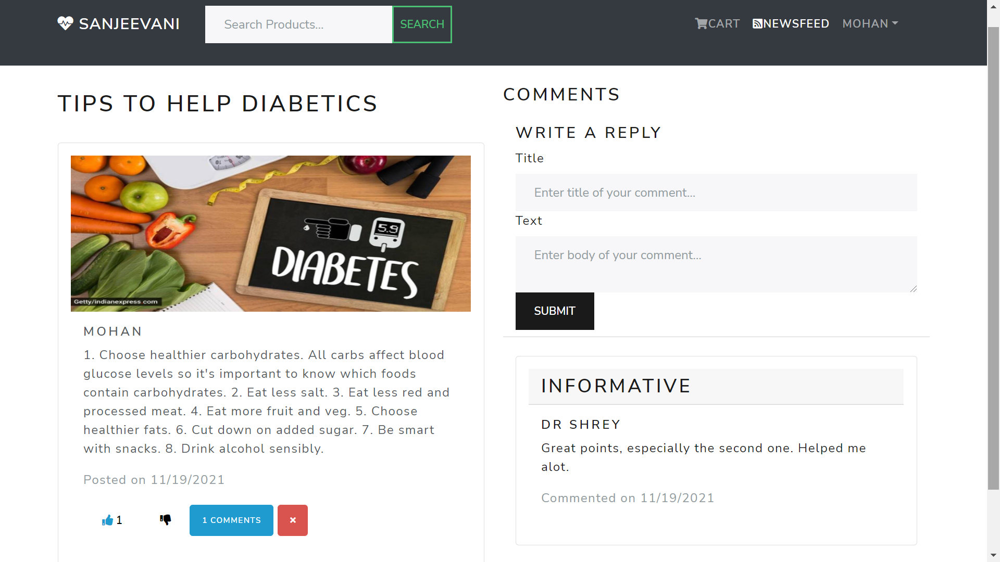
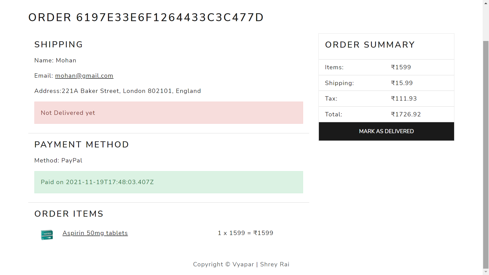

# Sanjeevani

> The hospital at your doorstep

The website is live [here](http://sanjeevni.herokuapp.com/) .
<br /><br />


## Technology Stack 🚀

- JavaScript <a href=""></a>
- React <code></code>
- Redux <code></code>
- Mongo DB <a href=""></a>
- Express <a href=""></a>
- Node JS <a href=""></a>
- CSS <a href=""></a>
- Heroku Cloud Service <a href=""></a>

## Specialities of the Website

1. Safe and secure authorization and authentication.
1. Hospitals can sell and users can buy medicines and health care related products using eCommerce features of the website which includes the following functionalities:
   - Features and roles for Users:
     - Fully featured shopping cart
     - Write product reviews and give ratings
     - Product carousel for top featured products
     - Product pagination
     - Search box for searching products
     - View current and previous order status in user profile section.
     - PayPal / credit card integration for providing multiple methods for payment.
   - Features and roles for the administrators/Hospital
     - Add/Delete products and modify product details in the product management area of website for selling.
     - Admin user management area for seeing the details of users and assigning roles.
     - Admin Order details page for seeing the orders of all users and their payment and delivery status.
     - Mark orders as delivered option.
1. Create posts and share them with the community:
   - Create posts and view posts of other members of the community in the Newsfeed.
   - Like and comment on posts created by other users.
   - Only a user who has created the post/comment can delete it to ensure freedom of expression to the user.
     <br/>

# Working Snapshots:

### Registration Page



### Login Page


<br />

### Home Page


<br />

### View Product Details


<br />

### View and give reviews on products



<br />

### Add products to shopping cart


<br />

### Place Order


<br />

### Provide Shipping Address for delivery


<br />

### Multiple Payment methods


<br />



<br />


<br />

### View status of past orders in user profile



<br />

### Create Posts for community in the Newsfeed section


<br />

### Like and comment on posts



## Admin Specific features for the doctors/hospital staff:

### View users list and assign/edit roles


<br />

### View and edit product details and add new products for selling


<br />

### Mark order as delivered once the product reaches the customer



<br />


<br />

### See payment and delivery status of all orders


<br/><br/>

## Run Locally

#### Clone the repository:

```bash
git@github.com:shreyrai99/sanjeevani.git
```

#### Install Server dependencies:

```bash
npm install
```

#### Install Client Dependencies:

```bash
cd frontend
npm install
```

#### Run Express and React

```bash
cd ..
npm run dev
```

#### Check in Browser

```bash
 http://localhost:5000/ : The Backend runs at port 5000
 http://localhost:3000/ : The Front-end runs at port 3000
```

## Support the project 💖

1. Create an issue in the repo for any new features you think can make this project more useful.
1. ⭐By starring the project. 😜

# Thanks! ❤️

> Vist the website by clicking [here](http://sanjeevni.herokuapp.com/) .
